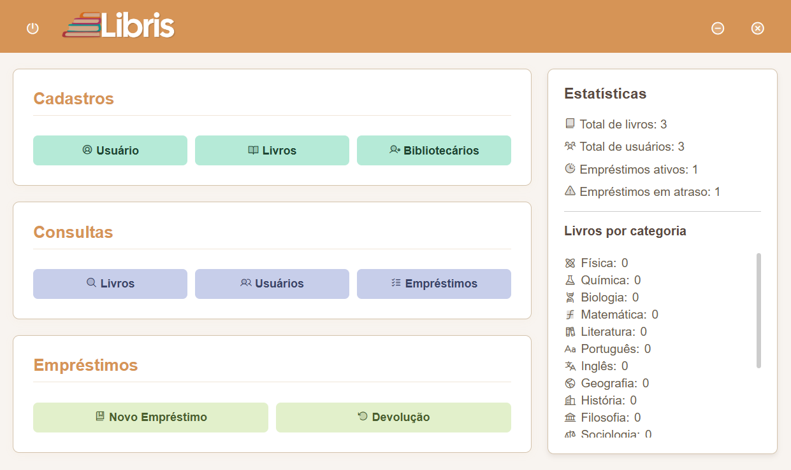

# 📚 Libris - Sistema de Gestão Bibliotecária

<div align="center">
  
  <p>Sistema completo para gestão de bibliotecas acadêmicas</p>
  
  
  
</div>

## ✨ Demonstração



## 🚀 Funcionalidades

### Módulos Principais
- **Cadastro de Livros** (com categorias específicas)
- **Gestão de Usuários** (estudantes)
- **Controle de Empréstimos** (com histórico completo)
- **Painel Administrativo** (para bibliotecários)

## 🛠 Tecnologias Utilizadas

<table>
  <tr>
    <td align="center">
      
      <br>Electron
    </td>
    <td align="center">
      
      <br>HTML5
    </td>
    <td align="center">
      
      <br>CSS3
    </td>
    <td align="center">
      
      <br>JavaScript
    </td>
    <td align="center">  <br>Select2 </td>
    
  </tr>
</table>

## 🔧 Instalação e Execução

```bash
# Clone o repositório
git clone https://github.com/JoaoPedro77/Libris.git

# Instale as dependências
npm install

# Execute em modo desenvolvimento
npm start
````

## 📌 Próximos Passos

- [ ] implementar um banco de dados

## 🤝 Como Contribuir

1. Faça um fork do projeto
2. Crie uma branch (`git checkout -b feature/nova-feature`)
3. Commit suas mudanças (`git commit -m 'Adiciona nova feature'`)
4. Push para a branch (`git push origin feature/nova-feature`)
5. Abra um Pull Request

## 📄 Licença

Este projeto está sob a licença MIT - veja o arquivo [LICENSE](LICENSE) para detalhes.

---

<div align="center">
  Desenvolvido com ❤️ :)</a>
</div>
